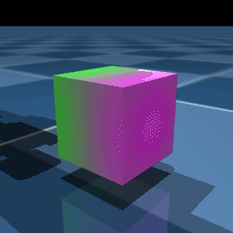
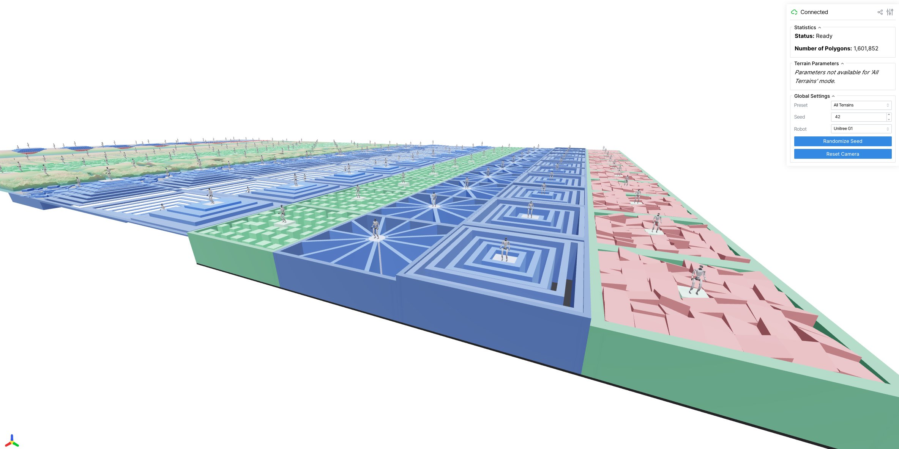

=========
Changelog
=========

Upcoming version (not yet released)
-----------------------------------

Added
^^^^^

- Added project documentation describing the bird, crawler, and Quad Mini
  environment layout for the new ``mjlab16`` workspace.
- Added the migrated Bird and three-DoF Crawler environments, including their
  robot assets, task configurations, domain randomization, and focused tests.
- Added the Quad Mini Tuned flat-terrain joystick environment, including its
  12-joint asset, source-matched observations and rewards, domain randomization,
  and focused integration tests.
- Added README instructions for checking, training, and pushing the custom
  Bird, Crawler, and Quad Mini environments.
- Added automatic local-checkpoint discovery to ``play`` when no checkpoint or
  W&B run path is provided.
- Added Quad Mini clean privileged teacher and five-frame student tasks with
  local teacher-checkpoint loading for distillation.
- Added automatic selection of the latest local Quad Mini teacher checkpoint
  when starting student distillation.
- Added a staged domain-randomization curriculum for the Quad Mini teacher that
  starts from nominal dynamics and reaches the existing full ranges after 5,000
  PPO iterations.
- Added the TONY5 V0 individual-rotor-speed position+yaw quadrotor task with
  physical rotor bodies, voltage-driven DC motor actuators with a measured-speed
  PID loop, and per-substep thrust and aerodynamic rotor-drag physics.
- Added the TONY5 V0 body-velocity tracking task with body-frame linear velocity
  and yaw-rate commands, velocity rewards, and command/actual velocity arrows.
- Added five-frame flattened actor and critic observation history to the TONY5
  velocity task.
- Added the ``Mjlab-Tony5-Velocity-Aero-v1`` task with MuJoCo ellipsoid body
  aerodynamics, vectorized local rotor airflow, and estimated rotor H-force.
- Added optional TONY5 Aero V1 keyboard velocity teleoperation in ``play``,
  including ``+``/``-`` horizontal-speed ceiling controls and equivalent Viser
  buttons.
- Added native-viewer analog gamepad velocity teleoperation for the TONY5 Aero
  V1 and Omni tasks.
- Added a standalone TONY5 Aero V1 motor and aerodynamic-load diagnostic runner
  for constrained/free-flight, H-force, body-fluid, and checkpoint-ramp tests.
- Enabled the existing MuJoCo-Warp NaN state dump guard for TONY5 Aero V1;
  V0 remains unchanged.
- Added a diagnostic-only TONY5 Aero V1 NaN ablation runner with body-aero and
  H-force switches plus first-divergence threshold capture.
- Added V1-only numerical safety monitoring with per-substep force suppression,
  finite-state detection, episode metrics, and focused regression tests.
- Added the V3 global-wind Omni task with independent optional CT(J)/CQ(J),
  blade-flapping, and battery-sag infrastructure, all disabled by default and
  guarded against non-finite aerodynamic or electrical values.
- Added V3 process-local H-force calibration sweeps and controlled battery
  diagnostics, including 4096-environment wind-off/on and combined-feature
  smoke checks.
- Enabled all optional V3 physics features in training and play mode: static
  CT/CQ fallback, blade flapping, battery sag, wind, and gusts.
- Made V3 wind and gust activation a shared 50% full-reset event; disabled
  resets run with both external wind effects off.

Changed
^^^^^^^

- Fixed TONY5 Omni V3 keyboard and gamepad horizontal commands to use fixed
  world-frame X/Y axes, matching the V3 policy observations and rewards; V0
  body-frame manual control is unchanged.
- Changed TONY5 play speed controls to native main-keyboard or keypad
  ``+``/``-`` keys and increased the manual play-only horizontal-speed ceiling
  to ``100 m/s``; training command limits remain unchanged.
- Changed V1/V3 numerical safety termination to use root speed above
  ``150 m/s``, body angular speed above ``200 rad/s``, absolute ``qacc`` above
  ``400,000``, or non-finite state; the rotor-qvel threshold was removed and
  safety flags no longer suppress custom rotor forces or motor voltage.
- Changed V3 play wind/gust flags to force 100% episode activation when either
  feature is enabled; training retains the 50% full-reset activation.
- Added an ``M`` play control and Viser button to immediately resample the
  velocity command and, for V3, the shared wind/gust process.
- Changed TONY5 Aero Omni V3 background wind to sample a shared horizontal
  speed uniformly from 0--10 m/s in any x/y direction, with vertical wind
  limited to -1--+1 m/s on full resets; command resampling is now 1--10 s and
  V0 is unchanged.
- Reduced routine TONY5 Aero Omni V3 logging to core safety, total-wind,
  voltage-sag, velocity-error, and active reward metrics; detailed prop,
  flapping, electrical, and per-axis wind diagnostics are no longer logged
  every episode.
- Reduced the V3 play Rewards panel to active nonzero reward terms only; the
  training reward configuration remains fully editable.
- Added V3 play switches ``--wind`` and ``--gusts``; both default to enabled
  and can be disabled independently.
- Enabled ``--keyboard`` and ``--gamepad`` for TONY5 Omni V3 play mode.
- Fixed V3 world-frame command observations and rewards to read the canonical
  world command buffer after keyboard/gamepad conversion; V0 is unchanged.
- Changed V3 automatic resume checkpoint selection to use timestamped V3 runs
  only, excluding the incompatible ``v0_bootstrap`` checkpoint.
- Increased default play playback speed to ``1.2x`` (20% faster); physics and
  policy timing remain unchanged, and ``--playback-speed`` can override it.
- Added a V3-only motor/rotor torque-squared penalty with weight ``-1e-6``;
  V0 and Omni V0 rewards are unchanged.
- Fixed the V3 motor/rotor torque penalty to use native actuator-force values;
  this avoids invalid generalized-DOF indexing on CUDA during ``env.step``.
- Centralized the complete V3 reward table and its tunable parameters in
  ``tony5_omni_v3_rewards.py``; reward values remain unchanged.
- Disabled command-transition smoothing for TONY5 Aero Omni V3 so sampled
  velocity targets are applied immediately; V0 command smoothing is unchanged.
- Changed default play checkpoint selection for TONY5 Aero Omni V3 to skip the
  incompatible ``v0_bootstrap`` checkpoint after the V3 observation size change.
- Changed TONY5 Aero Omni V3 observations to use world-frame linear velocity,
  explicit world-frame commands, and sine/cosine heading observations so world
  velocity tracking remains observable after yaw rotation; V0 is unchanged.
- Changed only TONY5 Aero Omni V3 linear velocity commands and tracking to
  world-frame x/y/z values; yaw-rate tracking remains body-frame and V0 is
  unchanged.
- Disabled unintended generic MuJoCo rotor-body fluid loading in TONY5 Aero V1
  with negligible zero-coefficient fluid geoms; V0 is unchanged.
- Changed TONY5 Aero V1 exploration to a fixed ``0.12`` actor standard
  deviation with zero entropy while leaving V0 PPO unchanged.
- Changed only the TONY5 Aero V1 ESC voltage clamp to ``0``-``22.2 V`` with
  asymmetric anti-windup; V0 retains its bidirectional voltage behavior.
- Added TONY5 target-position and target-yaw debug markers to the viewer and
  enabled a filtered full PID speed loop with conditional integral anti-windup.
- Changed TONY5 Aero V1 uprightness and roll/pitch-rate reward terms to relax
  with commanded horizontal speed while preserving yaw tracking and V0 rewards.
- Changed TONY5 Aero V1 to replace its uprightness reward with a gravity-free
  body-acceleration penalty while leaving V0 unchanged.
- Centralized the editable TONY5 Aero V1 reward coefficients in its environment
  configuration without changing the V0 reward table.
- Changed TONY5 Aero V1 PPO entropy coefficient to 0.003 and restored its
  learnable 0.6 initial actor standard deviation without an explicit range;
  V0 is unchanged.
- Added a 0.75-second settled high-speed RMSE diagnostic to TONY5 Aero V1 while
  retaining the transient high-speed RMSE diagnostic.
- Changed TONY5 Aero V1 to a deterministic four-stage curriculum: 2 m/s for the
  first 50 PPO iterations, 6 m/s for the next 50, 10 m/s for the next 100, and
  27.78 m/s for the remainder of training.
- Added a V1-only ``--high-speed-only`` play option that samples radial command
  speeds from 15 to 27.78 m/s, with configurable lower and upper bounds.
- Added a play-only ``--disturbance`` option for symmetric random base torque
  disturbances on the TONY5 Aero velocity tasks; training configurations and V0
  are unchanged.
- Removed the V1 angle/attitude termination while retaining it in V0.
- Added an editable soft downward-velocity reward penalty alongside the V1
  measured downward-velocity termination at -3.0 m/s; yaw-rate and vertical
  command limits still taper near the 27.78 m/s stage.
- Added a V1 roll-only uprightness reward with the existing 0.1 weight that
  activates only when commanded horizontal speed is above 8 m/s; V0 is unchanged.
- Changed the V1 body-acceleration penalty to a body-angular-acceleration
  penalty using MuJoCo's frame angular-acceleration sensor; V0 is unchanged.
- Changed only V1 high-speed horizontal command directions to progressively
  bias toward body-frame forward flight while retaining full omnidirectional
  sampling through 10 m/s.
- Changed TONY5 play mode to resample position and yaw targets every 4–8 seconds.
- Changed the TONY5 normalized rotor-speed action ceiling to 2600 rad/s so the
  full positive action range remains reachable with the V0 motor model.
- Changed TONY5 velocity play mode to use one environment by default; the play
  command automatically loads the newest local velocity-policy checkpoint.
- Relaxed TONY5 velocity tracking, increased action-rate smoothing, sampled
  zero-velocity hover commands more often, and disabled ground contact and
  ground-based termination for the velocity task.
- Versioned the TONY5 velocity PPO experiment for the new five-frame observation
  shape so older 22-value checkpoints are not loaded accidentally.
- Changed TONY5 Aero V1 velocity commands to use four radial horizontal-speed
  stages at 2, 6, 10, and 27.78 m/s, with previous-stage, current, and
  high-speed sampling branches.
- Changed TONY5 Aero V1 moving-command sampling to 50% previous-stage range,
  30% current-range, and 20% high-speed commands, with speed-dependent yaw
  limits; the high-speed RMSE remains diagnostic only.
- Reduced routine TONY5 Aero V1 logging to core tracking, curriculum, and
  numerical-safety metrics; zero-weight reward terms remain configured but are
  omitted from episodic reward diagnostics, and the always-zero timeout
  diagnostic is omitted while the timeout termination remains active.
- Changed TONY5 Aero V1 actor exploration to a learnable ``0.6`` initial
  standard deviation with entropy coefficient ``0.003``; V0 is unchanged.
- Changed TONY5 Aero V1 linear-velocity tracking sigma to a fixed value of
  ``2.0`` at every commanded speed; V0 and angular tracking sigma are unchanged.
- Added ``Mjlab-Tony5-Velocity-Aero-Omni-v0`` with fixed omnidirectional radial
  horizontal commands bounded at ``10 m/s`` and no curriculum progression.
- Added ``Mjlab-Tony5-Velocity-Aero-Omni-v3`` with one global canonical wind
  vector shared by native body fluid aerodynamics and custom rotor H-force,
  plus optional correlated global gusts; Omni V0 is unchanged.
- Changed V3 play mode to enable a ``+X 2 m/s`` background wind and correlated
  gusts by default; enlarged play-only base-torque disturbances to ``0.05 N*m``
  and apply them for ``0.5 s`` at uniformly chosen 3--6 second intervals; the
  viewer shows a single green total-wind arrow and a magenta disturbance arrow.
- Added a separate editable Omni reward table so its reward weights can be
  tuned without modifying TONY5 V0 or Aero-v1.
- Reduced the Omni smooth command transition time from ``1.0 s`` to
  approximately ``0.333 s`` while retaining smoothstep easing.
- Enabled ``--keyboard`` play control for the Omni task, including its smooth
  command transitions.
- Changed TONY5 native-viewer keyboard speed controls to ``I``/``O`` because
  MuJoCo reserves ``+``/``-`` for its built-in real-time speed shortcuts;
  Viser ``+``/``-`` buttons remain unchanged.
- Changed TONY5 Aero V1 and Omni vertical velocity commands to the symmetric
  ``-3`` to ``+3 m/s`` range.
- Changed the V1 rapid-descent termination threshold to measured downward
  velocity below ``-5 m/s``; its separate soft reward threshold remains
  ``-3 m/s``.
- Relaxed V1 numerical-safety limits by 2x: root speed ``100 m/s``, body
  angular speed ``60 rad/s``, rotor speed ``7,000 rad/s``, and absolute
  acceleration ``2e5``; non-finite states still fail immediately.
- Added TONY5 Aero V1 speed-adaptive velocity-tracking reward widths and
  reduced its PPO entropy coefficient while leaving V0 unchanged.
- Configured the Quad Mini joints with AK70-10 DC motor torque-speed limits,
  including a 50.3 rad/s velocity limit.
- Changed the Quad Mini reset root-height range to 0.20-0.25 m.
- Added five-frame history to the Quad Mini privileged teacher observation and
  the student-side privileged teacher input.
- Simplified the Bird environment layout to keep only the
  ``Mjlab-Velocity-Bird-5DoF`` task and its shared robot asset.
- Added README commands for training and playing the Crawler rough-terrain and
  flat-terrain teacher/student pairs.
- Matched the Quad Mini soft joint-limit penalty to MuJoCo Playground's direct
  endpoint scaling for asymmetric joint ranges.
- Removed the Quad Mini knee collision capsules so only the base and feet
  participate in robot-terrain collision.
- Reduced the Quad Mini joint-position action scale from 0.6 to 0.4 to limit
  commanded knee excursions.
- Clamped Quad Mini position-control targets to the robot's hard joint limits
  before sending them to the actuators.

Fixed
^^^^^

- Fixed Quad Mini default-pose randomization so ``qpos0`` remains a small joint
  reference offset instead of cancelling the configured standing pose.
- Matched the Quad Mini foot-clearance cost to MuJoCo Playground and fixed the
  foot-air-time reward to use the completed air phase when a foot lands.
- Fixed the Quad Mini reset height at exactly 0.22 m by removing root-height
  spawn randomization.
- Reduced the Quad Mini per-world contact allocation so training with thousands
  of parallel environments no longer exhausts GPU memory during initialization.
- Clipped Quad Mini policy actions to the normalized ``[-1, 1]`` range before
  applying joint-position targets, matching the Bird and Crawler runners.

Version 1.6.0 (August 8, 2026)
------------------------------

.. admonition:: Breaking API changes
   :class: attention

   - ``CollisionCfg`` now requires ``contype``, ``conaffinity``, ``condim``,
     and ``priority`` to be explicit instead of silently defaulting to
     MuJoCo's values, and dict values for these fields must cover every
     matched geom (add a catch-all ``".*"`` entry).
   - ``CommandTerm._update_command`` now takes an ``env_ids`` argument:
     ``None`` on the regular per-step update and the reset environment ids
     when called from ``reset()``. Custom command terms must add the
     parameter (construction raises a ``TypeError`` with migration
     instructions otherwise) and scope any per-step state advance, such as
     a motion frame index, to ``env_ids``.
   - ``ViewerConfig`` is now keyword-only; positional construction no
     longer works.

.. admonition:: Highlights
   :class: note

   - Upgraded to MuJoCo and MuJoCo Warp 3.11.
   - Upgraded ``rsl-rl-lib`` to 5.4.2.

Added
^^^^^

- Added ``GeomCfg``, exposed as the ``geoms`` field on ``EntityCfg``, a spec
  editor that matches geoms by name and patches their attributes. Supports
  ``group`` (so a geom can collide without being drawn) and all collision
  attributes; unset attributes are left untouched. Contribution by
  @bd-pmorais.
- Added ``diffuse``, ``specular``, ``ambient``, ``active``, and
  ``attenuation`` fields to ``LightCfg`` for configuring light color and
  falloff. Contribution by @bd-pmorais.
- Added ``random``, ``file``, ``cubefiles``, ``gridsize``, ``gridlayout``,
  ``nchannel``, ``hflip``, and ``vflip`` fields to ``TextureCfg``, so textures
  can be loaded from image files instead of only built-in patterns.
  ``width`` and ``height`` are now optional, since file-based textures take
  their size from the image. Contribution by @bd-pmorais.
- Added light domain randomization functions: ``dr.light_diffuse``,
  ``dr.light_specular``, ``dr.light_ambient``, ``dr.light_attenuation``,
  ``dr.light_cutoff``, and ``dr.light_exponent``. Contribution by @bd-pmorais.
- Added ``reduce="sum"`` to ``MetricsTermCfg`` for reporting the accumulated
  episode total (e.g. episodic reward, total distance traveled) instead of a
  per-step average. Contribution by @bd-mlutter
- Added ``ViewerConfig.geom_group`` and ``ViewerConfig.site_group`` to
  control which geom and site visualization groups the offscreen renderer
  draws. Defaults match MuJoCo's (groups 0 through 2), so rendering is
  unchanged unless configured. Contribution by @bd-mlutter.
- Added ``dr.mat_texid`` to randomize which texture fills a given
  ``mjtTextureRole`` slot (RGB by default) of each selected material,
  sampling uniformly from ``asset_cfg.texture_names``. Contribution by
  @bd-pmorais.

Changed
^^^^^^^

- Bumped ``mujoco`` and ``mujoco-warp`` from 3.10 to 3.11, and regenerated the
  bundled MuJoCo type stubs.
- Bumped ``rsl-rl-lib`` from 5.4.0 to 5.4.2.
- ``CollisionCfg`` and ``GeomCfg`` now share one write path, and mjlab warns
  when a ``GeomCfg`` collision patch is overwritten by a ``CollisionCfg``.
- Changed the default MuJoCo Warp render background to solid black
  (``0, 0, 0, 1``), matching MuJoCo's native renderer. Contribution by
  @bd-pmorais.
- The offscreen renderer now works on a copy of the ``MjModel``, so its
  render-only tweaks (extent, shadows, reflections, offscreen size) no
  longer leak into the shared model. Contribution by @bd-mlutter.
- ``ViewerConfig`` is now keyword-only, with fields grouped and documented.
  Contribution by @bd-mlutter.
- ``ViewerConfig.fovy`` now also applies to the ``ASSET_ROOT`` and
  ``ASSET_BODY`` tracking cameras instead of being silently ignored; leave
  it at ``None`` (the default) to keep the model value. Contribution by
  @bd-mlutter.
- ``auto_reset`` and an explicit ``reset()`` now leave identical command and
  event timer state (:issue:`1133`).

Fixed
^^^^^

- The Viser motion scrubber's Start Here button no longer computes relative
  body poses from stale pre-scrub kinematics, which could spuriously
  terminate the episode on the next step.
- Mid-episode lifting command resamples now refresh kinematics and the
  multi-cube reward cache, so observations and rewards no longer see
  pre-teleport object positions for one step after each resample.
- ``UniformVelocityCommand``'s ``init_velocity_prob`` path no longer writes
  the previous episode's terminal pose back into the sim on reset. It read
  derived kinematics before ``forward()`` ran and rewrote the root pose; it
  now reads only qpos for the orientation and writes only the root velocity.
- ``init_velocity_prob`` now applies on episode reset only. A mid-episode
  timer resample used to also teleport the root velocity, which ran after
  ``step()``'s forward and left velocity observations stale for one step.
- ``Entity.set_joint_position_target`` and its velocity/effort/tendon/site
  siblings now select the outer product when both ``env_ids`` and the element
  ids are tensors, instead of pairing them elementwise.
- ``MotionCommand`` now refreshes kinematics after a timer-expiry resample
  (finite ``resampling_time_range``), matching its wraparound path.
- ``CircularBuffer`` lag retrieval now clamps to the oldest retained frame;
  a lag beyond the buffer length used to wrap around to a newer frame.
- Camera sensor caches are now invalidated after ``sense()``, so a
  pre-sense read with ``clone_data=True`` can no longer pin the previous
  step's frame into the observations (mirrors the raycast fix for
  :issue:`998`).
- ``reset(env_ids=...)`` no longer appends a frame to every env's observation
  history and delay buffers; only the reset envs receive their post-reset
  frame. Previously, each manual partial reset gave the other envs a duplicate
  frame, shortening their effective history and drifting their delay
  schedules.
- ``reset(env_ids=...)`` no longer advances stateful commands in
  environments that were not reset. Previously a partial reset gave every
  environment an extra command update, so with ``auto_reset=False`` a
  ``MotionCommand`` reference motion played at twice the normal speed and
  could teleport non-reset robots via the wraparound resample. The adaptive
  sampling EMA also no longer folds on resets, matching auto-reset
  training dynamics. :issue:`1138`
- Interval event timers are now resampled on episode reset for function-based
  terms, as documented. Previously the countdown carried across episodes, so a
  new episode's first ``push_robot`` in the velocity and tracking tasks could
  fire arbitrarily soon after spawn; with mixed function and class interval
  terms, reset also wrote into the wrong timer slots. Note this changes push
  timing relative to earlier training runs, and an interval term whose range
  exceeds the episode length is now re-armed on every reset and will never
  fire.
- ``RayCastSensorCfg.include_geom_groups`` now raises on values outside
  ``[0, mjNGROUP)`` instead of silently excluding every geom.
- Geoms with a negative group no longer pick up group 5's visibility toggle in
  the Viser viewer.

Version 1.5.3 (July 22, 2026)
-----------------------------

Changed
^^^^^^^

- The Viser reward bar panel's term cap is now configurable via
  ``ViewerConfig.reward_bar_max_terms``, so environments with more than 20
  reward terms can show them all. Defaults to 20, preserving previous behavior.
  :issue:`1079`

Fixed
^^^^^

- Bumped ``pillow`` (12.3.0), ``onnx`` (1.22.0), and ``soupsieve`` (2.9.1) in the
  lockfile to pick up security fixes.
- Fixed raycast sensor debug visualization and observations lagging one step
  behind the sensed hits. ``sense()`` rebinds the hit tensors after the cache had
  already been repopulated by a pre-sense reward read, so ``.data`` returned the
  previous step's hits; the cache is now invalidated after ``postprocess_rays``.
  With ``ray_alignment="yaw"`` this made debug rays appear tilted by the foot's
  per-step motion instead of vertical. :issue:`998`
- Restored ONNX uploads and W&B run metadata for velocity and manipulation
  training when using RSL-RL's current ``WandbLogWriter`` logger name.
- The Viser reward bar panel no longer *silently* drops reward terms beyond
  ``max_terms``; it now emits a warning listing the hidden terms. Previously
  environments with more than 20 reward terms had the overflow disappear from
  the bar panel with no indication. :issue:`1079`
- Fixed the ``terrain_levels_vel`` curriculum promoting every env from level 0
  to level 1 on the initial reset, ignoring ``max_init_terrain_level=0``. Before
  the first step the robot sits at its spawn pose rather than a walked-to
  position, so the distance check was spurious; terrain levels are now frozen on
  that first reset. :issue:`1094`
- Fixed the velocity task's actor ``joint_pos`` observation not being biased by
  the ``encoder_bias`` domain randomization, so the encoder bias only affected
  actions and never the observed joint positions. The actor now observes biased
  joint positions while the critic keeps the true (unbiased) values as
  privileged information, matching the tracking task.
  See `discussion #1065 <https://github.com/mujocolab/mjlab/discussions/1065>`_.
- Hardened ``fit_terrain_normal`` against non-finite raycast hits. A single env
  with a diverged state produced a NaN/Inf covariance that made
  ``torch.linalg.eigh`` raise and abort the whole batch; such rows now fall back
  to the up vector. This stops the hard crash so a diverged env can be reset
  normally; it does not by itself make a diverged env's downstream reward finite.
  :issue:`912`
- Enabled ``obs_normalization`` on the Go1 velocity actor and critic to match
  the other velocity tasks. Without it, extreme-but-finite observations on rough
  terrain drove value/policy divergence that eventually surfaced as a
  ``normal expects all elements of std >= 0.0`` crash. Note that Go1 velocity
  checkpoints trained before this change carry no normalizer buffers and will no
  longer load; retrain from scratch. :issue:`870` :issue:`1044` :issue:`1053`
- Fixed ``ContactSensor`` air-time tracking accumulating float32 sim-clock
  differences, whose quantization error grows with the clock magnitude and made
  ``compute_first_contact`` / ``compute_first_air`` miss touchdowns on long runs.
  The exact float64 substep ``dt`` is now accumulated instead. :issue:`1101`
- Bumped ``mujoco-warp`` to 3.10.0.3, fixing a CUDA 700 illegal memory access in
  ``smooth.crb`` triggered by startup mass domain randomization (via
  ``set_const``) once ``num_envs >= 128`` on consumer Ada GPUs. :issue:`1108`

Version 1.5.2 (July 17, 2026)
-----------------------------

Fixed
^^^^^

- Fixed CUDA illegal memory accesses when domain randomization triggers
  ``set_const`` with multiple environments. ``actuator_acc0`` is now expanded
  per environment before MuJoCo Warp recomputes it.
- Fixed ``MaterialCfg.reflectance`` being ignored when building the MuJoCo
  spec. Contribution by @bd-pmorais.

Version 1.5.1 (July 15, 2026)
-----------------------------

Added
^^^^^

- Added ``MeshCfg``, a spec editor that matches mesh assets by name and edits
  their asset-level attributes. The first attribute is ``maxhullvert``, which
  caps the collision convex hull's vertex count to lower narrowphase cost.
- Added ``SimulationCfg.broadphase`` and ``SimulationCfg.broadphase_filter``
  to configure MuJoCo Warp's broadphase collision algorithm and
  bounding-volume filters.

Changed
^^^^^^^

- Enabled skybox rendering for camera sensors. Contribution by @bd-pmorais.
- Bumped the minimum ``mujoco-warp`` to 3.10.0.2, which fixes ``qfrc_constraint``
  being populated incorrectly across vectorized environments (:issue:`1086`).
  Earlier 3.10.0.x releases are no longer supported.
- Command delay on fusable actuators (ideal PD, DC motor) now applies one shared
  lag per environment across all fused actuators sharing a delay config, matching
  the built-in actuator path, rather than an independent lag per actuator group
  (:issue:`1035`).

Fixed
^^^^^

- Fixed ``TerrainGenerator`` overwriting custom geom names set by sub-terrain
  functions with the default ``terrain_{i}`` name. Only unnamed geoms are now
  auto-named.
- Fixed ``TorchArray`` not expanding world-shared model fields to ``nworld``
  with mujoco_warp 3.10.0.2, which allocates them as real size-1 arrays
  instead of stride-0 broadcast views. Multi-env indexing of fields like
  ``soft_joint_pos_limits`` raised ``IndexError`` during resets (:issue:`1093`).
- Fixed ``mdp.bad_orientation`` returning NaN when float32 rounding in
  ``quat_apply_inverse`` pushed the projected-gravity z-component slightly
  outside ``[-1, 1]``, making ``torch.acos`` return NaN and silently
  suppressing the termination for flipped robots. The argument is now clamped
  to ``[-1, 1]``.
- Fixed a crash when using command delay on ideal PD (or other custom)
  actuators whenever ``num_envs`` differed from the number of delayed targets,
  and fused ideal PD and DC motor actuators sharing a transmission and delay
  config into a single gather, delay, control-law evaluation, and control
  write, removing per-group host overhead (:issue:`1035`).

Version 1.5.0 (June 28, 2026)
-----------------------------

Added
^^^^^

- Added ``reduce="max"`` to ``MetricsTermCfg`` for reporting episode-peak values
  (e.g. peak power, peak contact force) without needing stateful wrapper classes.
- Added ``BuiltinDcMotorActuator``, a native MuJoCo ``<dcmotor>`` wrapper.
  Supports voltage / position / velocity input modes with back-EMF,
  configurable motor constants, and optional integral, slew, inductance,
  thermal, LuGre, and cogging extensions.
- Added ``scale_with_difficulty`` to ``HfRandomUniformTerrainCfg``. When
  enabled, the noise amplitude scales with difficulty (flat at 0, full
  ``noise_range`` at 1) so the terrain progresses in a curriculum. Defaults to
  ``False``, preserving the previous difficulty-independent behavior.
- Added material domain randomization functions for MuJoCo Warp RGB rendering:
  ``dr.mat_emission``, ``dr.mat_specular``, ``dr.mat_shininess``, and
  ``dr.mat_texrepeat``.

Changed
^^^^^^^

- Bumped ``rsl-rl-lib`` from 5.2.0 to 5.4.0.
- Bumped ``mujoco`` and ``mujoco-warp`` to 3.10, both pinned from PyPI. The
  ``py.mujoco.org`` nightly index and the ``mujoco-warp`` git pin are dropped, so
  resolution no longer breaks when nightly wheels are garbage-collected.

  .. warning::

     ``SimulationCfg.ls_parallel`` is deprecated and now ignored, since parallel
     linesearch was removed upstream in MuJoCo Warp. Setting it emits a
     ``DeprecationWarning``; remove it from any ``SimulationCfg`` you construct.
- Curriculum-mode terrain difficulty is now deterministic across rows
  and reaches the configured ``difficulty_range`` endpoints
  (:issue:`1027`).
- Heightfield terrains now color by absolute height with a diverging palette
  (cool below the ground plane, green at ground level, warm above) on a fixed
  scale, replacing the per-patch normalization. Color is now consistent across
  terrains, and low-amplitude terrain such as ``random_rough`` reads as gently
  tinted ground instead of high-contrast noise.
- ``BoxNestedRingsTerrainCfg`` now builds uniform-height concentric ridges
  whose separating gaps widen with difficulty, replacing the random per-ring
  heights. Rings are colored by height (like the other terrains) and the outer
  border matches the ring height.
- Terrain generation no longer prints timing information to stdout.

Fixed
^^^^^

- Fixed domain randomization events that target different ``axes`` of the same
  model field (e.g. two ``dr.geom_size`` events scaling axis 0 and axis 1
  separately) silently clobbering each other. Each event now writes back only
  the axes it targeted, so per-axis events compose (:issue:`1042`).
- Regenerated the bundled MuJoCo type stubs, which had drifted from the
  installed mujoco version. CI now regenerates them and fails if they are
  stale, so they stay in sync going forward. Run ``make stubs`` to update them
  (:issue:`1048`).
- Fixed ``select_gpus`` crashing when ``CUDA_VISIBLE_DEVICES`` contains MIG
  UUIDs instead of numeric indices.
- Fixed pyramid-stairs terrains (``BoxPyramidStairsTerrainCfg``,
  ``BoxInvertedPyramidStairsTerrainCfg``, and ``BoxOpenStairsTerrainCfg``)
  leaving an empty, geometry-free border at difficulty 0, where the step
  height collapses to zero. The flat border frame is now always generated as
  solid geometry flush with the ground (:issue:`1033`).
- Fixed ``HfPerlinNoiseTerrainCfg`` failing to compile at difficulty 0, where
  the target height collapses to zero and MuJoCo rejects the non-positive
  heightfield size.
- Fixed ``BoxRandomGridTerrainCfg`` producing NaN colors (and failing to build)
  at difficulty 0, where the grid height is zero and the color normalization
  divided by zero.
- Fixed the center platform z-fighting with surrounding geometry in
  ``BoxRandomGridTerrainCfg`` (grid cells were left underneath the platform) and
  ``BoxRandomSpreadTerrainCfg`` (the platform duplicated the floor surface).
- Fixed ``BoxNarrowBeamsTerrainCfg`` square platform corners protruding between
  the beams at high difficulty; the platform now shrinks to stay within the
  beams' angular coverage.
- Fixed ``BoxSteppingStonesTerrainCfg`` reconfiguring abruptly at a difficulty
  threshold, where the stone grid re-tiled as its spacing crossed an integer
  boundary, and leaving an oversized gap around the center platform. The grid is
  now difficulty-independent and the platform snaps to it as a clean island.
- Fixed ``train --video``, ``play``, and ``demo`` crashing with ``OpenGL
  platform library not loaded`` on headless Linux hosts that don't pre-set
  ``MUJOCO_GL``. The default is now applied in ``mjlab/__init__.py`` (Linux
  only) so it takes effect before mujoco's GL backend selection runs.
- Fixed motion tracking re-anchoring to a stale robot pose after a mid-episode
  motion resample. ``MotionCommand._update_command`` now calls ``sim.forward()``
  after resampling so relative body poses read the post-teleport state
  (:issue:`1068`).

Version 1.4.0 (May 26, 2026)
----------------------------

Added
^^^^^

- Added ``BuiltinPdActuator``, the implicit-integration version of
  ``IdealPdActuator``. Same interface (position + velocity targets,
  kp/kd gains), but expresses the PD as native MuJoCo ``<position>``
  and ``<velocity>`` elements so the ``implicit`` / ``implicitfast``
  integrators include the kp/kd derivatives in their velocity update.
  The actuator stays stable at gain/timestep combinations where
  explicit Python PD would diverge, which matters when you want to
  run a real motor's stiff on-board PD gains in sim. ``effort_limit``
  is enforced as a sum-clamp on the two PD terms via
  ``jnt_actfrcrange`` (or ``tendon_actfrcrange``). Supported by
  ``dr.pd_gains`` and ``dr.effort_limits``.
- Added ``mdp.projected_gravity_from_sensor``, an observation that derives
  projected gravity from a ``framezaxis`` up-vector sensor (negated) rather
  than from the root body orientation. Unlike ``mdp.projected_gravity``, it
  reflects the sensor's site frame, so it can observe IMU mounting domain
  randomization (e.g. via ``dr.site_quat``). Go1 and G1 ship an
  ``imu_upvector`` sensor for this.
- Added ``DebugVisualizer.add_box`` for drawing an axis-oriented box
  primitive, mirroring ``add_ellipsoid``. Supported by both the native
  and Viser viewers. ``size`` is the box half-extents (:issue:`992`).
- Added ``--log-root`` CLI option to ``train``, ``play``, and ``evaluate``
  scripts for choosing where training logs are stored. Defaults to
  ``logs/rsl_rl`` (unchanged behavior). Useful for directing outputs to a
  scratch disk or shared mount.
- ``RewardManager``, ``TerminationManager``, and ``MetricsManager`` now
  validate that every term function returns a tensor of shape
  ``(num_envs,)`` when evaluated, raising a clear ``ValueError``
  naming the offending term instead of silently broadcasting or crashing
  with an opaque error later during training.
- Added ``ContactSensor.primary_names`` property to expose the resolved
  primary names in the order they appear along the per-contact axis of the
  output tensors. This makes it possible to map a contact-data column back
  to the primary it belongs to (:issue:`914`).
- Added per-world mesh variant support via ``VariantEntityCfg``. Each
  world in a batched simulation can now use a different mesh asset for
  the same logical entity (e.g. world 0 holds a cube, world 1 a
  sphere). Variants are passed as a ``dict[str, Callable]`` of named
  spec callables; the optional ``assignment`` field controls how worlds
  map to variants and accepts ``None`` (uniform), a ``dict[str, float]``
  of per-variant weights, or a custom ``Callable[[int], Sequence[int]]``.
  Mesh-derived constants (collision bounds, body inertials, subtree
  mass, inverse weights) are compiled per-variant and stored as
  per-world arrays in the Warp model, so domain randomization, the
  native viewer, the offscreen renderer, and the Viser viewer all pick
  up the variant assignment automatically. Variants must share the
  same kinematic structure (same bodies, joints, joint types); only
  mesh geoms may differ. Assignment is fixed at simulation init. See
  :ref:`heterogeneous_worlds` for usage. With help from @XiangruiJiang.
- Per-world mesh variants now support per-variant materials and textures.
  Each variant can reference its own named material, which is automatically
  prefixed and scattered via ``geom_matid`` alongside the existing
  ``geom_dataid`` table. Variants without a material get ``matid = -1``.
  Contribution by @omarrayyann.
- Added ``dr.geom_matid`` to randomize which baked material each geom uses
  per environment, sampling uniformly from ``asset_cfg.material_names``.
  Contribution by @bd-pmorais.

Changed
^^^^^^^

- ``Entity`` now raises a clear error at construction when its spec contains
  more than one freejoint. An entity models a single system rooted at one
  body, so it has at most one freejoint; a second one was previously accepted
  silently and only surfaced later as a cryptic shape mismatch when writing
  root state. Model each detached floating body as its own entry in
  ``SceneCfg.entities`` instead.
- Changed ``compute_root_relative_mpkpe`` to re-anchor the reference to the
  robot's root each step, removing yaw drift as well as translation so it
  measures intrinsic body pose error.
- Changed ``compute_joint_velocity_error`` from an L2 norm to a per-joint
  RMS, so it no longer scales with the number of joints.
- Bumped ``mujoco`` to 3.8 and ``mujoco-warp`` to 3.8.0. The ``multiccd``
  enable flag was removed in mujoco 3.8 (it became default-on), so configs
  that listed ``"multiccd"`` in ``MujocoCfg.enableflags`` need to drop it.
- Camera segmentation now matches ``mujoco_warp``'s typed segmentation
  output. ``CameraSensorData.segmentation`` stores ``(object_id,
  object_type)`` pairs in shape ``[B, H, W, 2]`` instead of the previous
  legacy geom-id-only layout. Contribution by @tkelestemur.
- Sped up ``RayCaster`` post-processing by removing boolean-mask indexing
  operations and replacing them with ``masked_fill_`` plus a clamped-distance
  formulation of ``hit_pos_w`` that places misses at the world origin. This
  removes all CUDA syncs from the ray post-process, letting the CPU thread
  proceed while GPU-based sensing runs. Contribution by @bd-pdomanico.
- Bumped ``rsl-rl-lib`` from 5.0.1 to 5.2.0. This brings ``torch.compile`` support for
  PPO and Distillation, and optional std clamping and constant std in
  ``GaussianDistribution``. No code changes required on the mjlab side.
- ``TerrainEntityCfg`` debug visualization sites (environment origins,
  terrain origins, flat patches) are now off by default. Set
  ``debug_vis=True`` to re-enable them. The sites inflated ``nsite`` and
  caused a measurable slowdown in the per-step ``site_local_to_global``
  kernel (:issue:`942`).
- Task package load failures during ``mjlab`` import now print the full
  traceback (and the entry point's module path) to ``stderr`` instead of
  just the exception message, making it easier to pinpoint the source of
  import errors when running commands like ``list-envs`` (:issue:`910`).
  Contribution by @saikishor.
- Clarified ``ContactSensor`` shape conventions: per-contact fields
  (``found``, ``force``, ``torque``, ``dist``, ``pos``, ``normal``,
  ``tangent``) have shape ``[B, P * num_slots, ...]`` while per-primary
  air-time fields (``current_air_time``, ``last_air_time``,
  ``current_contact_time``, ``last_contact_time``) have shape ``[B, P]``,
  where ``P`` is the number of resolved primaries (:issue:`914`).
- Event functions now share a single ``resolve_env_ids`` helper to expand
  ``env_ids=None`` to all environments, replacing five copies of the same
  guard. ``push_by_setting_velocity`` and ``apply_external_force_torque``
  accept ``env_ids=None`` too, so they work as global-time interval terms.
  Documented when to use ``apply_external_force_torque`` (a constant,
  self-managed wrench) versus ``apply_body_impulse`` (transient, automatic
  impulses) versus ``push_by_setting_velocity`` (an instantaneous velocity
  kick).

Fixed
^^^^^

- Removed use of deprecated ``warp-lang`` symbols (``wp.context.runtime``
  and ``wp.context.Device``) that were dropped in newer ``warp-lang``
  releases, causing ``AttributeError: module 'warp' has no attribute
  'context'`` at import/runtime. mjlab now uses
  ``wp.get_cuda_driver_version()`` and ``wp.Device`` instead
  (:issue:`967`). Contribution by @rdeits.
- Fixed the tracking ``evaluate`` script scoring each metric against the
  next motion frame; the reference is now snapshotted before each step to
  match the reward.
- Fixed the tracking end-effector metrics silently scoring zero for an
  unknown body name; they now raise ``ValueError``.
- Fixed ``compute_mpkpe`` measuring root-relative instead of global error;
  it now uses the global reference ``body_pos_w`` (:issue:`1006`).
- Fixed heavy flicker in offscreen training videos on rough-terrain tasks.
  The renderer recomputed its context "neighbor" robots every frame from
  ``env_origins``, which the terrain curriculum mutates on reset, so the
  neighbor set kept changing and robots popped in and out. The neighbor
  set is now computed once and cached (:issue:`979`).
- Fixed command delay only applying to an actuator's position target.
  ``IdealPdActuator`` and ``DcMotorActuator`` also use velocity and effort, which
  arrived undelayed and out of sync; all command targets now share one delay.
  Zero-reference setups are unaffected.
- Fixed duplicate random seeds across nodes in multi-node training. The
  per-process seed offset in ``scripts/train.py`` now uses the global
  ``RANK`` instead of ``LOCAL_RANK``. Contribution by @bd-pdomanico.
- Fixed ``apply_body_impulse`` firing an impulse on the very first step (and
  the first step after every reset) instead of starting with a cooldown as
  documented. The cooldown is now sampled lazily on the first call so impulse
  timing is decorrelated from episode resets (:issue:`973`).
- Fixed ``dr.pd_gains`` and ``dr.effort_limits`` silently no-oping when
  passed an ``Operation`` object (e.g. ``dr.scale``) instead of a string.
  Both functions now accept ``Operation | str`` like every other DR event
  and raise ``ValueError`` for unsupported operations (:issue:`971`).
- Fixed ``ContactSensor`` with ``global_frame=True`` and
  ``reduce`` ∈ {``"none"``, ``"mindist"``, ``"maxforce"``} producing forces
  rotated onto the wrong axis. The contact-frame→world rotation matrix had
  its columns ordered ``[tangent, tangent2, normal]`` instead of
  ``[normal, tangent, tangent2]``, projecting the normal-force component
  onto a tangent direction. Contribution by @bd-pdomanico.
- Fixed ``extras["log"]`` entries written by reward terms (e.g. ``Metrics/*``
  values in velocity tasks) being silently discarded on any step where at
  least one environment resets. ``_reset_idx`` was clearing the dict after
  ``reward_manager.compute()`` had already populated it. The clear now
  happens at the top of ``step()`` and ``reset()`` so that all entries
  survive (:issue:`957`).
- Fixed ``ContactSensor.compute_first_contact`` and ``compute_first_air``
  occasionally missing events when a contact began or ended right at the
  last physics substep of a control step. ``current_contact_time`` /
  ``current_air_time`` accumulate in float32 and can drift a few ULPs past
  ``dt``, but the default ``abs_tol`` of ``1e-8`` sat at the noise floor
  and rejected the comparison. Raised the default to ``1e-6``, which stays
  well below typical control ``dt`` while comfortably covering float32
  accumulation noise (:issue:`933`). Contribution by @paLeziart.
- Fixed ``out_of_terrain_bounds`` using stale terrain dimensions. It read
  ``TerrainGeneratorCfg.num_cols`` directly, which is ignored in curriculum
  mode (the generator uses ``len(sub_terrains)`` columns instead), and it
  did not account for ``border_width``. The termination now reads the
  effective grid shape from ``terrain.terrain_origins`` and includes the
  border in the footprint, so robots no longer reset while still on valid
  terrain (or fail to reset after running off it) (:issue:`923`).
- ``ObservationManager`` now skips observation groups that end up with
  zero active terms (e.g. all terms set to ``None``) with a log message,
  instead of crashing later in ``torch.stack``/``torch.cat``. This lets
  a shared runner config define groups that become empty under certain
  runtime flags (e.g. model-specific terms all disabled for one variant).
  The whole group can still be set to ``None`` to disable it explicitly.
- Fixed a runtime broadcast error in ``ContactSensor`` when combining
  ``num_slots > 1`` with ``track_air_time=True`` and more than one primary.
  Air-time tracking now reduces ``found`` across slots so that a primary is
  considered in contact when any of its slots reports a match (:issue:`914`).
- Updated the ``create_new_task.ipynb`` Colab tutorial to import
  ``XmlActuatorCfg`` instead of the removed ``XmlVelocityActuatorCfg``.
  Added a regression test (``tests/test_notebooks.py``) that parses each
  notebook cell and verifies that every ``from mjlab... import X``
  reference resolves, so future renames in the mjlab public API can't
  silently rot the tutorials (:issue:`913`).
- Fixed ``ObservationManager`` silently sharing a single ``NoiseModelCfg``
  instance across observation groups that declared terms with the same
  name. ``_group_obs_class_instances`` was keyed by term name alone, so
  the last group processed in ``_prepare_terms`` overwrote earlier
  groups' instances. Symptoms included the wrong noise config being
  applied, shared per-episode state for ``NoiseModelWithAdditiveBias``
  (e.g. bias drawn from the wrong ``bias_noise_cfg``), and missed
  ``reset()`` calls for overwritten instances. Instances are now keyed
  by ``(group_name, term_name)`` so each group owns its own noise model.
- Fixed ``CurriculumManager.get_active_iterable_terms`` raising
  ``TypeError`` when a term's state was a dict. The dict branch indexed
  the output list by term name instead of appending to the local ``data``
  list. No in-tree caller currently invokes this method, so the bug was
  latent.

Version 1.3.0 (April 14, 2026)
------------------------------

Added
^^^^^

- Added ``ManagerBasedRlEnvCfg.auto_reset`` flag. When ``True`` (default),
  ``step()`` continues to reset done environments in place and returns the
  post-reset observation. When ``False``, ``step()`` skips the reset block
  and returns the terminal observation directly; the caller must call
  ``reset(env_ids=...)`` for done environments before the next ``step()``
  or a ``RuntimeError`` is raised. Enables access to the true terminal
  state for algorithms that need it. Note that mjlab's bundled ``train.py``
  uses rsl_rl's ``OnPolicyRunner``, which does not drive manual resets, so
  ``auto_reset=False`` is intended for custom training loops (:issue:`900`).
- Added ``ActuatorCfg.viscous_damping`` for passive velocity proportional
  damping (``f = -b·v``), distinct from the PD derivative gain ``damping``
  used by position and velocity actuators. Maps to ``<joint damping>`` for
  JOINT transmission and ``<tendon damping>`` for TENDON transmission.
  Defaults to ``None`` (preserves the XML value).
- Added :class:`~mjlab.managers.RecorderManager` for logging observations,
  actions, or arbitrary environment data during rollouts. Implement a
  :class:`~mjlab.managers.RecorderTerm` subclass and register it in the
  ``recorders`` dict on ``ManagerBasedRlEnvCfg``. The manager provides
  ``record_pre_reset``, ``record_post_reset``, and ``record_post_step``
  lifecycle hooks with no opinion on how data is stored.
- Added :func:`~mjlab.envs.mdp.curriculums.termination_curriculum` for
  scheduling changes to termination term parameters during training,
  matching the existing ``reward_curriculum`` pattern. Both now share a
  single internal engine with init-time validation of stage ordering,
  field existence, and param keys.
- Added ``reduce`` field to ``MetricsTermCfg``. Setting ``reduce="last"``
  reports the value from the final step of the episode rather than the
  episode mean, which is useful for binary success metrics.
- Added :class:`~mjlab.envs.mdp.actions.RelativeJointPositionAction` for
  joint position control relative to the current configuration. The target is
  ``current_pos + action * scale``, so a zero action holds the current
  configuration rather than commanding the default pose.
- Added :func:`~mjlab.envs.mdp.dr.pair_friction` for randomizing geom-pair
  friction overrides (``pair_friction`` in ``mjModel``), with an
  ``isotropic=True`` option that mirrors the symmetric tangent and roll
  axes so single-axis randomization does not leave the paired axis stale.
- Added ``STAIRS_TERRAINS_CFG`` terrain preset for progressive stair
  curriculum training and ``@terrain_preset`` decorator for composing
  terrain configurations from reusable presets.
- Added cartpole balance and swingup tasks (``Mjlab-Cartpole-Balance`` and
  ``Mjlab-Cartpole-Swingup``) with a :ref:`tutorial <tutorial-cartpole>`
  that walks through building an environment from scratch.
- Added :ref:`motion imitation <motion-imitation>` documentation with
  preprocessing instructions. The README now links here instead of the
  BeyondMimic repository, which produced incompatible NPZ files when used
  with mjlab (:issue:`777`).
- Added ``margin``, ``gap``, and ``solmix`` fields to ``CollisionCfg``
  for per geom contact parameter configuration (:issue:`766`).
- NaN guard now captures mocap body poses (``mocap_pos``, ``mocap_quat``)
  when the model has mocap bodies, enabling full state reconstruction in
  the dump viewer for fixed-base entities.
- Implemented ``ActionTermCfg.clip`` for clamping processed actions after
  scale and offset (:issue:`771`).
- Added ``qfrc_actuator`` and ``qfrc_external`` generalized force accessors
  to ``EntityData``. ``qfrc_actuator`` gives actuator forces in joint space
  (projected through the transmission). ``qfrc_external`` recovers the
  generalized force from body external wrenches (``xfrc_applied``)
  (:issue:`776`).
- Added ``RewardBarPanel`` to the Viser viewer, showing horizontal bars for
  each reward term with a running mean over ~1 second (:issue:`800`).
- Added ``per_substep`` flag to ``MetricsTermCfg`` for evaluating metrics
  once per physics substep inside the decimation loop. The per substep
  values are averaged within each environment step, so episode averages
  remain comparable to regular per step metrics.
- Added ``project-instinct/InstinctMJ`` to the research page's list of
  projects built on mjlab.
- Added a Checkpoints tab to the Viser play viewer for hot-swapping
  checkpoints without restarting. Works with local directories and W&B
  runs (:issue:`751`). Contribution by @omarrayyann.
- Added ``"segmentation"`` camera data type for per-pixel geom ID output
  alongside RGB and depth, and a multi-cube goal-conditioned lifting task
  (``Mjlab-Multi-Cube-Seg-Yam``) that uses it (:issue:`862`).
  Contribution by @pthangeda.

Changed
^^^^^^^

- Renamed the ``list_envs`` console script to ``list-envs`` for consistency
  with the other hyphenated entry points (``viz-nan``, ``export-scene``).
  Invoke via ``uv run list-envs``.
- ``ActuatorCfg.armature`` and ``ActuatorCfg.frictionloss`` now default to
  ``None`` instead of ``0.0``. ``None`` preserves the value defined in the
  XML. Previously, builtin actuators would silently overwrite XML joint and
  tendon properties with zero when these fields were not explicitly set.
  To restore the old behavior, pass ``armature=0.0`` or ``frictionloss=0.0``
  explicitly.
- Actuator delay is now configured inline on any ``ActuatorCfg`` subclass
  (e.g. ``BuiltinPositionActuatorCfg(..., delay_min_lag=2, delay_max_lag=5)``)
  instead of wrapping with ``DelayedActuatorCfg``. ``DelayedActuator``,
  ``DelayedActuatorCfg``, and ``DelayedBuiltinActuatorGroup`` are removed.
- Removed ``delay_target`` from ``ActuatorCfg``. Delay now always applies to
  the actuator's ``command_field`` automatically. Multi-target delay
  (``delay_target=("position", "velocity")``) is no longer supported.
- ``XmlPositionActuatorCfg``, ``XmlVelocityActuatorCfg``, ``XmlMotorActuatorCfg``,
  and ``XmlMuscleActuatorCfg`` are replaced by a single ``XmlActuatorCfg`` that auto
  detects the actuator type from XML. Pass ``command_field=...`` to override detection.
- Replaced the viser viewer internals with the ``mjviser`` package. Scene
  creation, mesh conversion, and overlay rendering (contacts, forces,
  inertia, tendons, joints, frames) are now provided by mjviser. The viewer
  exposes a new Visualization tab for overlay controls and a Groups tab for
  geom/site visibility. Debug visualization and warp tensor conversion remain
  in mjlab's ``MjlabViserScene`` subclass (:issue:`839`).
- In curriculum terrain mode, each terrain type now gets exactly one column
  (``num_cols`` is set to ``len(sub_terrains)``). The ``proportion`` field
  now controls robot spawning distribution across columns rather than column
  count. Random mode is unchanged (:issue:`811`).
- ``BoxSteppingStonesTerrainCfg`` stone size now decreases with difficulty,
  interpolating from the large end of ``stone_size_range`` at difficulty 0
  to the small end at difficulty 1 (:issue:`785`).
- Removed deprecated ``TerrainImporter`` and ``TerrainImporterCfg`` aliases.
  Use ``TerrainEntity`` and ``TerrainEntityCfg`` instead (:issue:`667`).
- ``Entity.clear_state()`` is deprecated. Use ``Entity.reset()`` instead.
  ``clear_state`` only zeroed actuator targets without resetting actuator
  internal state (e.g. delay buffers), which could cause stale commands
  after teleporting the robot to a new pose.
- Removed ``EntityData.generalized_force``. The property was bugged (indexed
  free joint DOFs instead of articulated DOFs) and the name was ambiguous.
  Use ``qfrc_actuator`` or ``qfrc_external`` instead (:issue:`776`).
- ``get_wandb_checkpoint_path`` now filters checkpoints server-side via the
  ``pattern`` parameter, avoiding unnecessary pagination and tolerance to
  corrupted metadata (:issue:`898`).

Fixed
^^^^^

- ``train`` and ``play`` now print a top-level usage message when invoked
  with ``-h`` / ``--help`` and no task argument, pointing users at
  ``list-envs`` and ``<TASK> --help`` (:issue:`905`).
- Fixed ghost geom filtering in the Viser viewer. Ghost geoms were selected
  by collision flags, so collision-disabled robot geoms appeared as ghosts.
  The viewer now uses visual alpha to determine which geoms to render.
- Scene now warns when an attached entity or terrain spec has non-default
  ``<option>`` fields (e.g. ``<flag contact="disable"/>``), which are
  silently dropped by ``MjSpec.attach()``. Use ``MujocoCfg`` to set
  simulation options instead (:issue:`885`).
- Fixed ``SceneEntityCfg`` names and IDs ordering mismatch when
  ``preserve_order=False`` (:issue:`876`). Contribution by @jsw7460.
- Fixed ONNX export path resolution in the velocity, manipulation, and
  tracking runners when a parent directory name contains the word
  ``"model"`` (:issue:`867`). Contribution by @gokulp01.
- ``export-scene`` now writes only referenced assets and places them
  correctly under the output directory. Previously, asset keys containing
  path traversal could write files outside the output directory, and all
  spec assets were included regardless of whether the scene XML referenced
  them (:issue:`858`).
- ``electrical_power_cost`` now uses ``qfrc_actuator`` (joint space) instead
  of ``actuator_force`` (actuation space) for mechanical power computation.
  Previously the reward was incorrect for actuators with gear ratios other
  than 1 (:issue:`776`).
- ``create_velocity_actuator`` no longer sets ``ctrllimited=True`` with
  ``inheritrange=1.0``. This caused a ``ValueError`` for continuous joints
  (e.g. wheels) that have no position range defined (:issue:`787`).
- ``write_root_com_velocity_to_sim`` no longer fails with tensor ``env_ids``
  on floating base entities (:issue:`793`).
- Joint limits for unlimited joints are now set to [-inf, inf] instead of
  [0, 0]. Previously the zero range caused incorrect clamping for entities
  with unlimited hinge or slide joints.
- Contact force visualization now copies ``ctrl`` into the CPU ``MjData``
  before calling ``mj_forward``. Actuators that compute torques in Python
  (``DcMotorActuator``, ``IdealPdActuator``) previously showed incorrect
  contact forces because the viewer ran with ``ctrl=0``
  (:issue:`786`).
- ``BoxSteppingStonesTerrainCfg`` no longer creates a large gap around the
  platform. Stones are now only skipped when their center falls inside the
  platform; edges that extend under the platform are allowed since the
  platform covers them (:issue:`785`).
- ``dr.pseudo_inertia`` no longer loads cuSOLVER, eliminating ~4 GB of
  persistent GPU memory overhead. Cholesky and eigendecomposition are now
  computed analytically for the small matrices involved (4x4 and 3x3)
  (:issue:`753`).
- Set terrain geom mass to zero so that the static terrain body does not
  inflate ``stat.meanmass``, which made force arrow visualization invisible
  on rough terrain (:issue:`734`, :issue:`537`).
- Native viewer now syncs ``qpos0`` when domain randomized, fixing incorrect
  body positions after ``dr.joint_default_pos`` randomization
  (:issue:`760`).
- ``command_manager.compute()`` is now called during ``reset()`` so that
  derived command state (e.g. relative body positions in tracking
  environments) is populated before the first observation is returned
  (:issue:`761`).
- ``RayCastSensor`` with ``ray_alignment="yaw"`` or ``"world"`` now correctly
  aligns the frame offset when attached to a site or geom with a local offset
  from its parent body. Previously only ray directions and pattern offsets were
  aligned, causing the frame position to swing with body pitch/roll
  (:issue:`775`).

Version 1.2.0 (March 6, 2026)
-----------------------------

.. admonition:: Breaking API changes
   :class: attention

   - ``randomize_field`` no longer exists. Replace calls with typed functions
     from the new ``dr`` module (e.g. ``dr.geom_friction``, ``dr.body_mass``).
   - ``EventTermCfg`` no longer accepts ``domain_randomization``. The
     ``@requires_model_fields`` decorator on each ``dr`` function takes care
     of field expansion automatically.
   - ``Scene.to_zip()`` is deprecated. Use ``Scene.write(path, zip=True)``.
   - ``RslRlModelCfg`` no longer accepts ``stochastic``, ``init_noise_std``,
     or ``noise_std_type``. Use ``distribution_cfg`` instead
     (e.g. ``{"class_name": "GaussianDistribution", "init_std": 1.0,
     "std_type": "scalar"}``). Existing checkpoints are automatically
     migrated on load.

Added
^^^^^

- Added ``"step"`` event mode that fires every environment step.
- Added ``apply_body_impulse`` event for applying transient external wrenches
  to bodies with configurable duration and optional application point offset.
- ONNX auto-export and metadata attachment for manipulation tasks (lift cube)
  on every checkpoint save, matching the velocity and tracking task behavior.
- Multi-frame ``RayCastSensor``: pass a tuple of ``ObjRef`` to ``frame`` for
  per-site raycasting with independent body exclusion. New properties:
  ``num_frames``, ``num_rays_per_frame``. New ``RayCastData`` fields:
  ``frame_pos_w`` and ``frame_quat_w``.
- ``RingPatternCfg`` ray pattern for concentric ring sampling around each
  frame.
- ``TerrainHeightSensor``, a ``RayCastSensor`` subclass that computes
  per-frame vertical clearance above terrain (``sensor.data.heights``).
  Velocity task configs now use it for ``feet_clearance``,
  ``feet_swing_height``, and ``foot_height``, replacing the previous
  world-Z proxy that was incorrect on rough terrain.
- Cloud training support via `SkyPilot <https://skypilot.readthedocs.io/>`_
  and Lambda Cloud, with documentation covering setup, monitoring, and
  cost management.
- W&B hyperparameter sweep scripts that distribute one agent per GPU
  across a multi-GPU instance.
- Contributing guide with documentation for shared Claude Code commands
  (``/update-mjwarp``, ``/commit-push-pr``).
- Added optional ``ViewerConfig.fovy`` and apply it in native viewer camera
  setup when provided.
- Native viewer now tracks the first non-fixed body by default (matching
  the Viser viewer behavior introduced in
  ``716aaaa58ad7bfaf34d2f771549d461204d1b4ba``).
- New ``dr`` module (``mjlab.envs.mdp.dr``) replacing ``randomize_field``
  with typed per-field domain randomization functions. Each function
  automatically recomputes derived fields via ``set_const``. Highlights:

  - Camera and light randomization: ``dr.cam_fovy``, ``dr.cam_pos``,
    ``dr.cam_quat``, ``dr.cam_intrinsic``, ``dr.light_pos``,
    ``dr.light_dir``. Camera and light names are now supported in
    ``SceneEntityCfg`` (``camera_names`` / ``light_names``).
  - ``dr.pseudo_inertia`` for physics-consistent randomization of
    ``body_mass``, ``body_ipos``, ``body_inertia``, and ``body_iquat``
    via the pseudo-inertia matrix parameterization (Rucker & Wensing
    2022). Replaces the removed ``dr.body_inertia`` /
    ``dr.body_iquat``.
  - ``dr.geom_size`` with automatic recomputation of ``geom_rbound``
    and ``geom_aabb`` for broadphase consistency.
  - ``dr.tendon_armature`` and ``dr.tendon_frictionloss``.
  - ``dr.body_quat``, ``dr.geom_quat``, and ``dr.site_quat`` with RPY
    perturbation composed onto the default quaternion.
  - Extensible ``Operation`` and ``Distribution`` types. Users can define
    custom operations and distributions as class instances and pass them
    anywhere a string is accepted. Built-in instances (``dr.abs``,
    ``dr.scale``, ``dr.add``, ``dr.uniform``, ``dr.log_uniform``,
    ``dr.gaussian``) are exported from the ``dr`` module.
  - ``dr.mat_rgba`` for per-world material color randomization. Tints
    the texture color, useful for randomizing appearance of textured
    surfaces. Material names are now supported in ``SceneEntityCfg``
    (``material_names``).
  - Fixed ``dr.effort_limits`` drifting on repeated randomization.
  - Fixed ``dr.body_com_offset`` not triggering ``set_const``.

- ``export-scene`` CLI script to export any task scene or asset_zoo entity
  (``g1``, ``go1``, ``yam``) to a directory or zip archive for inspection
  and debugging.

- ``yam_lift_cube_vision_env_cfg`` now randomizes cube color (``dr.geom_rgba``)
  on every reset when ``cam_type="rgb"``.

- The native viewer now reflects per-world DR changes to visual model fields
  on each reset. Geom appearance, body and site poses, camera parameters,
  and light positions are all synced from the GPU model before rendering.
  Inertia boxes (press ``I``) and camera frustums (press ``Q``) update
  correctly when the corresponding fields are randomized. See
  :doc:`randomization` for viewer-specific caveats.

- ``MaterialCfg.geom_names_expr`` for assigning materials to geoms by
  name pattern during ``edit_spec``.

- ``TerrainEntityCfg`` now exposes ``textures``, ``materials``, and
  ``lights`` as configurable fields (previously hardcoded). Set
  ``textures=()``, ``materials=()`` to use flat ``dr.geom_rgba``
  instead of the default checker texture.

- ``DebugVisualizer`` now supports ellipsoid visualization via
  ``add_ellipsoid``.

- Interactive velocity joystick sliders in the Viser viewer. Enable the
  joystick under Commands/Twist to override velocity commands with manual
  sliders for ``lin_vel_x``, ``lin_vel_y``, and ``ang_vel_z``
  (`#666 <https://github.com/mujocolab/mjlab/issues/666>`_).
- Per-term debug visualization toggles in the Viser viewer. Individual
  command term visualizers (e.g. velocity arrows) can now be toggled
  independently under Scene/Debug Viz.
- Viewer single-step mode: press RIGHT arrow (native) or click "Step"
  (Viser) to advance exactly one physics step while paused.
- Viewer error recovery: exceptions during stepping now pause the viewer
  and log the traceback instead of crashing the process.
- Native viewer runs forward kinematics while paused, keeping
  perturbation visuals accurate.
- Viewer speed multipliers use clean power-of-2 fractions (1/32x to 1x).

- Visualizers display the realtime factor alongside FPS.

- ``joint_torques_l2`` now respects ``SceneEntityCfg.actuator_ids``,
  allowing penalization of a subset of actuators instead of all of them
  (`#703 <https://github.com/mujocolab/mjlab/pull/703>`_). Contribution by
  `@saikishor <https://github.com/saikishor>`_.

- Terrain is now a proper ``Entity`` subclass (``TerrainEntity``). This
  allows domain randomization functions to target terrain parameters
  (friction, cameras, lights) via ``SceneEntityCfg("terrain", ...)``.
  ``TerrainImporter`` / ``TerrainImporterCfg`` remain as aliases but will be
  deprecated in a future version.
- Added ``upload_model`` option to ``RslRlBaseRunnerCfg`` to control W&B model
  file uploads (``.pt`` and ``.onnx``) while keeping metric logging enabled
  (`#654 <https://github.com/mujocolab/mjlab/pull/654>`_).
- ``Scene.write(output_dir, zip=False)`` exports the scene XML and mesh
  assets to a directory (or zip archive). Replaces ``Scene.to_zip()``.
- ``Entity.write_xml()`` and ``Scene.write()`` now apply XML fixups
  (empty defaults, duplicate nested defaults) and strip buffer textures
  that ``MjSpec.to_xml()`` cannot serialize.
- ``fix_spec_xml`` and ``strip_buffer_textures`` utilities in
  ``mjlab.utils.xml``.

Changed
^^^^^^^

- Native viewer now syncs ``xfrc_applied`` to the render buffer and draws
  arrows for any nonzero applied forces. Mouse perturbation forces are
  converted to ``qfrc_applied`` (generalized joint space) so they coexist
  with programmatic forces on ``xfrc_applied`` without conflict.
- ``ViewerConfig.OriginType.WORLD`` now configures a free camera at the
  specified lookat point instead of auto tracking a body. A new ``AUTO``
  origin type (now the default) preserves the previous auto tracking
  behavior.
- Upgraded ``rsl-rl-lib`` from 4.0.1 to 5.0.1. ``RslRlModelCfg`` now
  uses ``distribution_cfg`` dict instead of ``stochastic`` /
  ``init_noise_std`` / ``noise_std_type``. Existing checkpoints are
  automatically migrated on load.
- Reorganized the Viser Controls tab into a cleaner folder hierarchy:
  Info, Simulation, Commands, Scene (with Environment, Camera, Debug Viz,
  Contacts sub-folders), and Camera Feeds. The Environment folder is
  hidden for single-env tasks and the Commands folder is hidden when no
  command terms are active.
- Viser camera tracking is now enabled by default so the agent stays in
  frame on launch.
- Self collision and illegal contact sensors now use ``history_length`` to
  catch contacts across decimation substeps. Reward and termination functions
  read ``force_history`` with a configurable ``force_threshold``.
- Replaced the single ``scale`` parameter in ``DifferentialIKActionCfg`` with
  separate ``delta_pos_scale`` and ``delta_ori_scale`` for independent scaling
  of position and orientation components.
- Improved offscreen multi environment framing by selecting neighboring
  environments around the focused env instead of first N envs.
- Tuned tracking task viewer defaults for tighter camera framing.
- Disabled shadow casting on the G1 tracking light to avoid duplicate
  stacked shadows when robots are close.

Fixed
^^^^^

- Fixed actuator target resolution for entities whose ``spec_fn`` uses
  internal ``MjSpec.attach(prefix=...)``
  (`#709 <https://github.com/mujocolab/mjlab/issues/709>`_).
- Fixed viewer physics loop starving the renderer by replacing the single
  sim-time budget with a two-clock design (tracked vs actual sim time).
  Physics now self-corrects after overshooting, keeping FPS smooth at all
  speed multipliers.
- Bundled ``ffmpeg`` for ``mediapy`` via ``imageio-ffmpeg``, removing the
  requirement for a system ``ffmpeg`` install. Thanks to
  `@rdeits-bd <https://github.com/rdeits-bd>`_ for the suggestion.
- Fixed ``height_scan`` returning ~0 for missed rays; now defaults to
  ``max_distance``. Replaced ``clip=(-1, 1)`` with ``scale`` normalization
  in the velocity task config. Thanks to `@eufrizz <https://github.com/eufrizz>`_
  for reporting and the initial fix (`#642 <https://github.com/mujocolab/mjlab/pull/642>`_).
- Fixed ghost mesh visualization for fixed-base entities by extending
  ``DebugVisualizer.add_ghost_mesh`` to optionally accept ``mocap_pos`` and
  ``mocap_quat`` (`#645 <https://github.com/mujocolab/mjlab/pull/645>`_).
- Fixed viser viewer crashing on scenes with no mocap bodies by adding
  an ``nmocap`` guard, matching the native viewer behavior.
- Fixed offscreen rendering artifacts in large vectorized scenes by applying
  a render local extent override in ``OffscreenRenderer`` and restoring the
  original extent on close.
- Fixed ``RslRlVecEnvWrapper.unwrapped`` to return the base environment,
  ensuring checkpoint state restore and logging work correctly when wrappers
  such as ``VideoRecorder`` are enabled.

Version 1.1.1 (February 14, 2026)
---------------------------------

Added
^^^^^

- Added reward term visualization to the native viewer (toggle with ``P``) (`#629 <https://github.com/mujocolab/mjlab/pull/629>`_).
- Added ``DifferentialIKAction`` for task-space control via damped
  least-squares IK. Supports weighted position/orientation tracking,
  soft joint-limit avoidance, and null-space posture regularization.
  Includes an interactive viser demo (``scripts/demos/differential_ik.py``) (`#632 <https://github.com/mujocolab/mjlab/pull/632>`_).

Fixed
^^^^^

- Fixed ``play.py`` defaulting to the base rsl-rl ``OnPolicyRunner`` instead
  of ``MjlabOnPolicyRunner``, which caused a ``TypeError`` from an unexpected
  ``cnn_cfg`` keyword argument (`#626 <https://github.com/mujocolab/mjlab/pull/626>`_). Contribution by
  `@griffinaddison <https://github.com/griffinaddison>`_.

Changed
^^^^^^^

- Removed ``body_mass``, ``body_inertia``, ``body_pos``, and ``body_quat``
  from ``FIELD_SPECS`` in domain randomization. These fields have derived
  quantities that require ``set_const`` to recompute; without that call,
  randomizing them silently breaks physics (`#631 <https://github.com/mujocolab/mjlab/pull/631>`_).
- Replaced ``moviepy`` with ``mediapy`` for video recording. ``mediapy``
  handles cloud storage paths (GCS, S3) natively (`#637 <https://github.com/mujocolab/mjlab/pull/637>`_).

.. figure:: _static/changelog/native_reward.png
   :width: 80%

Version 1.1.0 (February 12, 2026)
---------------------------------

Added
^^^^^

- Added RGB and depth camera sensors and BVH-accelerated raycasting (`#597 <https://github.com/mujocolab/mjlab/pull/597>`_).
- Added ``MetricsManager`` for logging custom metrics during training (`#596 <https://github.com/mujocolab/mjlab/pull/596>`_).
- Added terrain visualizer (`#609 <https://github.com/mujocolab/mjlab/pull/609>`_). Contribution by
  `@mktk1117 <https://github.com/mktk1117>`_.

- Added many new terrains including ``HfDiscreteObstaclesTerrainCfg``,
  ``HfPerlinNoiseTerrainCfg``, ``BoxSteppingStonesTerrainCfg``,
  ``BoxNarrowBeamsTerrainCfg``, ``BoxRandomStairsTerrainCfg``, and
  more. Added flat patch sampling for heightfield terrains (`#542 <https://github.com/mujocolab/mjlab/pull/542>`_, `#581 <https://github.com/mujocolab/mjlab/pull/581>`_).
- Added site group visualization to the Viser viewer (Geoms and Sites
  tabs unified into a single Groups tab) (`#551 <https://github.com/mujocolab/mjlab/pull/551>`_).
- Added ``env_ids`` parameter to ``Entity.write_ctrl_to_sim`` (`#567 <https://github.com/mujocolab/mjlab/pull/567>`_).

Changed
^^^^^^^

- Upgraded ``rsl-rl-lib`` to 4.0.0 and replaced the custom ONNX
  exporter with rsl-rl's built-in ``as_onnx()`` (`#589 <https://github.com/mujocolab/mjlab/pull/589>`_, `#595 <https://github.com/mujocolab/mjlab/pull/595>`_).
- ``sim.forward()`` is now called unconditionally after the decimation
  loop. See :ref:`faq-sim-forward` for details (`#591 <https://github.com/mujocolab/mjlab/pull/591>`_).
- Unnamed freejoints are now automatically named to prevent
  ``KeyError`` during entity init (`#545 <https://github.com/mujocolab/mjlab/pull/545>`_).

Fixed
^^^^^

- Fixed ``randomize_pd_gains`` crash with ``num_envs > 1`` (`#564 <https://github.com/mujocolab/mjlab/pull/564>`_).
- Fixed ``ctrl_ids`` index error with multiple actuated entities (`#573 <https://github.com/mujocolab/mjlab/pull/573>`_).
  Reported by `@bwrooney82 <https://github.com/bwrooney82>`_.
- Fixed Viser viewer rendering textured robots as gray (`#544 <https://github.com/mujocolab/mjlab/pull/544>`_).
- Fixed Viser plane rendering ignoring MuJoCo size parameter (`#540 <https://github.com/mujocolab/mjlab/pull/540>`_).
- Fixed ``HfDiscreteObstaclesTerrainCfg`` spawn height (`#552 <https://github.com/mujocolab/mjlab/pull/552>`_).
- Fixed ``RaycastSensor`` visualization ignoring the all-envs toggle (`#607 <https://github.com/mujocolab/mjlab/pull/607>`_).
  Contribution by `@oxkitsune <https://github.com/oxkitsune>`_.

Version 1.0.0 (January 28, 2026)
--------------------------------

Initial release of mjlab.
